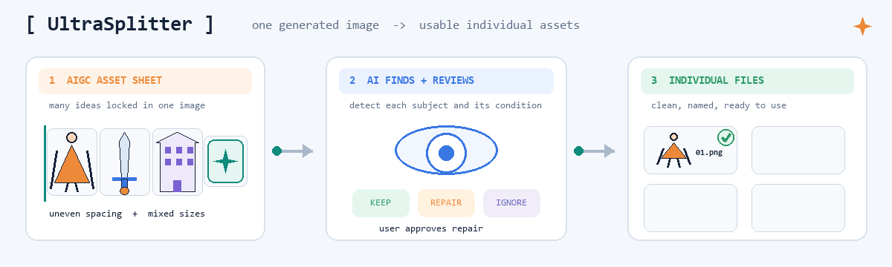
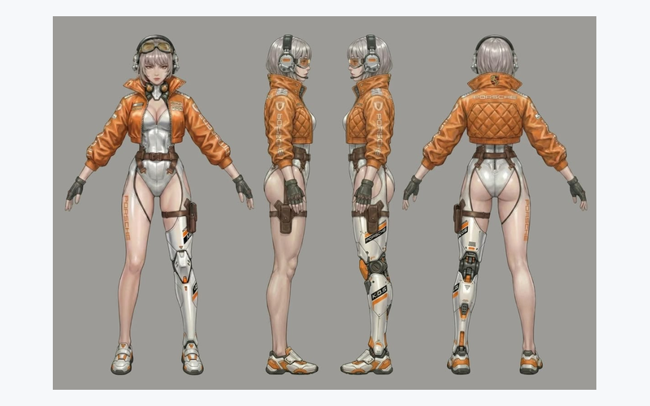
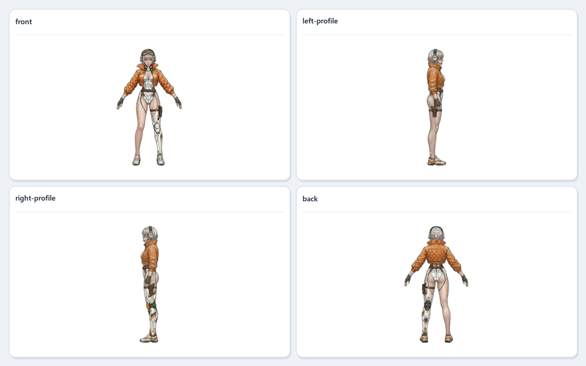
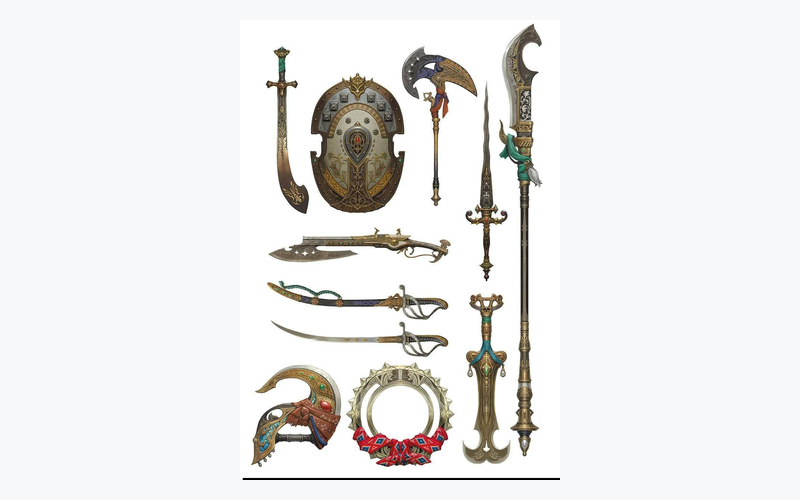
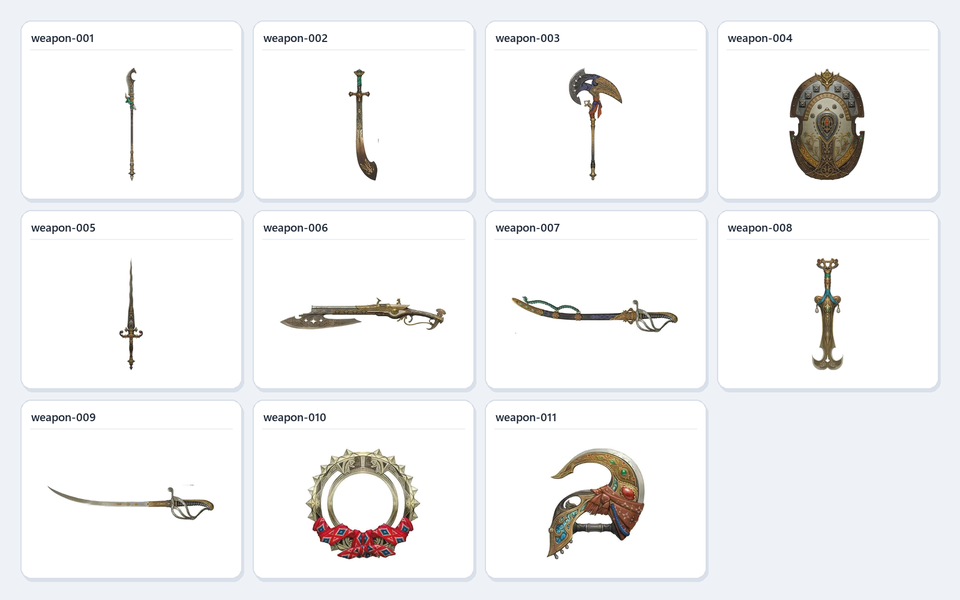
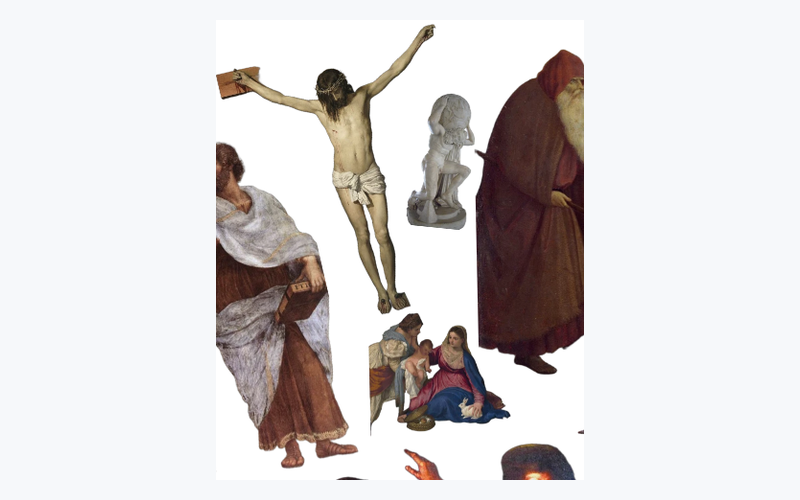
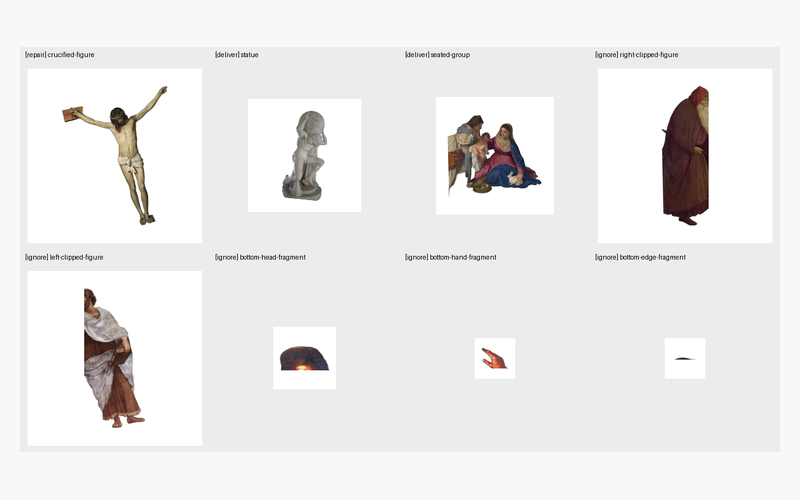
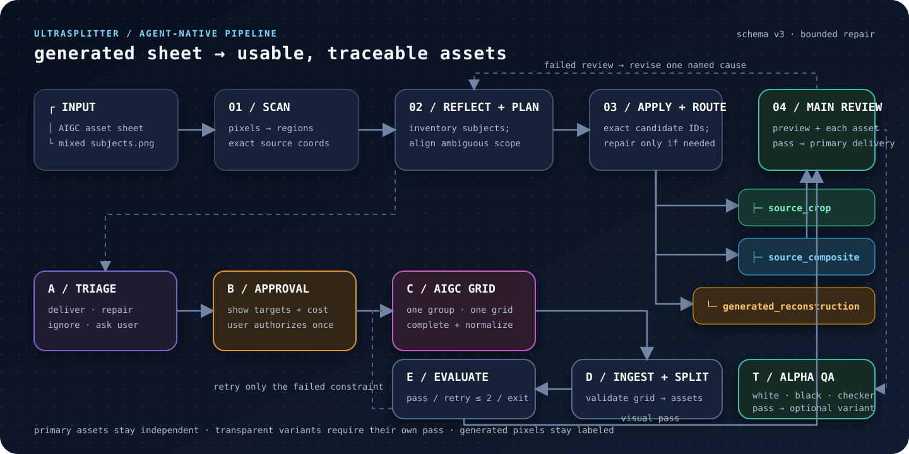

# UltraSplitter

[English](README.md) | [简体中文](README.zh-CN.md)



[](#quickstart) [](#showcases) [](https://github.com/PlevanTem/UltraSplitter/releases) [](https://github.com/PlevanTem/UltraSplitter/issues) [](#support)

<sub>Illustrated workflow · <a href="docs/assets/banner-static.png">Static view</a></sub>

**Turn AIGC sheets into individual assets your production pipeline can actually use.**

Image models are good at presenting a family of ideas in one image: a UI icon set, weapon collection, character turnaround, building elevation sheet, furniture board, or product-variant grid. The sheet may look finished, but the assets inside it are still trapped in one bitmap. Uneven spacing, mixed scale, labels, touching silhouettes, and edge-clipped subjects make equal slicing unreliable.

> Status: v0.1.0 provides a working deterministic splitter and a provider-neutral contract for generated repair. It does not call an image-generation API by itself.

## Why UltraSplitter

UltraSplitter is designed for people already generating visual assets and now need clean, separate files:

- **UI and product design** — split icon families, interface states, illustrations, badges, and component variants.
- **Game production** — extract characters, turnarounds, weapons, props, costumes, inventory art, and concept-sheet elements.
- **Architecture and interiors** — separate elevations, façade options, material samples, furniture concepts, and presentation-board assets.
- **General creative production** — turn moodboards and variation sheets into named, reviewable files for downstream tools.

Instead of asking a vision model to guess crop coordinates, UltraSplitter lets the multimodal host judge *what each subject is* while deterministic code handles *where its source pixels are*.

## What UltraSplitter provides

- **Content-aware splitting** — finds subjects when positions, widths, scale, and spacing are irregular; no equal-grid assumption.
- **Source-first output** — intact assets remain original-pixel crops. Separable overlaps use foreground masks and clean re-layout rather than regeneration.
- **Approval-gated AIGC repair** — recognizable clipped or occluded subjects are grouped into one efficient repair grid. The user sees the scope before any generation call.
- **Bounded quality loop** — generated grids are checked for count, duplicates, background, resolution, edge contact, safe margin, and visible identity; each group stops after at most two attempts.
- **Production-ready delivery** — named primary images, independently reviewed optional transparent variants, compact review sheets, provenance, status, evaluation evidence, and absolute access paths are written to `output/` and `manifest.json`.
- **Agent-native operation** — install the Skill for Codex, Claude Code, or another compatible coding agent, or use the Python CLI directly.

## Showcases

Real inputs processed by the current workflow. Result previews use automatic card grids and normalize each subject by its longest dimension, so dense sheets remain readable without changing the delivered files. Click either image for the full-size version.

<table>
  <thead>
    <tr>
      <th width="20%">Scenario</th>
      <th width="40%">Input</th>
      <th width="40%">Result</th>
    </tr>
  </thead>
  <tbody>
    <tr>
      <td><strong>Uneven layout</strong><br><code>success</code> · 4 subjects<br><sub>Four source crops, semantically reordered. No generated pixels.</sub></td>
      <td align="center"><a href="docs/assets/case-uneven-input.png"></a></td>
      <td align="center"><a href="docs/assets/case-uneven-output.png"></a></td>
    </tr>
    <tr>
      <td><strong>Dense asset sheet</strong><br><code>success</code> · 11 subjects<br><sub>Six source crops and five source composites; one border false positive rejected.</sub></td>
      <td align="center"><a href="docs/assets/case-dense-input.png"></a></td>
      <td align="center"><a href="docs/assets/case-dense-output.png"></a></td>
    </tr>
    <tr>
      <td><strong>Edge-clipped collage</strong><br><code>success</code> · 5 subjects<br><sub>Two source composites and three approved reconstructions; three identity-poor fragments ignored.</sub></td>
      <td align="center"><a href="docs/assets/case-clipped-input.png"></a></td>
      <td align="center"><a href="docs/assets/case-clipped-output.png"></a></td>
    </tr>
  </tbody>
</table>

## Quickstart

### 1. AI-native: add the Skill

Install the single Skill directly from its repository path:

```bash
npx skills@latest add https://github.com/PlevanTem/UltraSplitter/tree/main/.agents/skills/splitting-image-grids-by-content
```

Then ask your agent in ordinary language:

```text
Use splitting-image-grids-by-content to split @generated-sheet.png.
Deliver every usable subject and ask me before reconstructing clipped ones.
```

The Skill reuses an installed `ultrasplit` CLI runtime or loads the Python package from this repository when the runtime is missing. The runtime performs deterministic scan, apply, routing, and manifest operations; the host model still owns semantic inventory, scope alignment, and visual review.

### 2. Install and run the CLI

```bash
git clone https://github.com/PlevanTem/UltraSplitter.git
cd UltraSplitter
python -m pip install -e .
ultrasplit run input.png --output-dir output/character-views
# Inspect the contact sheet and every delivery image, then record the visual verdict:
ultrasplit evaluate output/character-views/manifest.json --visual-verdict pass
# Promote optional alpha candidates only after white, black, and checkerboard review:
ultrasplit evaluate output/character-views/manifest.json --transparent-verdict pass
```

`ultrasplit run` is a deterministic shortcut for simple inputs. It does not replace the Skill's model-guided inventory and scope-alignment workflow, and its output remains `needs_review` until an explicit visual pass.

<details>
<summary>Explicit scan, plan, repair, and evaluation commands</summary>

The multimodal agent can drive each state explicitly:

```bash
ultrasplit scan input.png --output-dir work/scan
ultrasplit apply input.png --scan work/scan/scan.json --plan work/plan.json --output-dir output/task
ultrasplit inspect output/task/manifest.json
ultrasplit repair prepare output/task/manifest.json
# The host agent shows the request to the user and waits for approval.
ultrasplit repair approve output/task/manifest.json --group conflict-001
# The host generates one grid from the repair packet, then returns it:
ultrasplit repair ingest output/task/manifest.json --group conflict-001 --grid generated-grid.png
ultrasplit evaluate output/task/manifest.json --visual-verdict pass
```

</details>

## Architecture



Every run writes a schema-v3 manifest with exact source coordinates, route evidence, provenance, approval state, bounded repair attempts, evaluation status, and absolute delivery paths. See [ARCHITECTURE.md](ARCHITECTURE.md).

## Current boundary

- Supports framed panels and spatially separated objects on transparent or approximately uniform backgrounds.
- Does not perform complex semantic instance segmentation.
- Generated completion is reconstructed content, not recovered source truth.
- Every delivery route requires an explicit visual pass. Dense, transparent, touching, or clipped cases may additionally require scope alignment, semantic triage, or repair approval.
- Transparent candidates are never automatic deliverables. Only independently reviewed paths appear in `delivery.transparent_images`; failed or rejected alpha variants do not invalidate approved primary assets.

## Roadmap

- [ ] **Download, open, split.** Package a desktop GUI, starting with Windows: drag in images, preview results, approve repairs, and open exported assets. No Python or Node setup for local splitting; model-backed repair requirements stay explicit.
- [ ] **Improve against real tasks.** Expand UI, game, and architecture cases. Track just three headline measures: **task delivery pass rate, end-to-end completion time, and human intervention count**.
- [ ] **Establish an honest baseline.** Compare with uniform slicing, LibTV grid splitting, and Lovart image layering on shared tasks. Report extraction and generated reconstruction separately, including unsupported cases. Competitor testing is planned, not yet completed.

See the [evaluation protocol and milestones (中文)](docs/ROADMAP.md). These are planned capabilities, not claims about the current release.

<a id="support"></a>

## Custom workflows & support

Need a workflow adapted to your UI assets, game library, or architecture boards? Custom consulting will cover workflow design, integration, and delivery requirements. Optional sponsorship supports maintenance and test coverage; it is separate from paid consulting.

- **Custom consulting · WeChat:** `lelouchdbf` — search this ID in WeChat and mention UltraSplitter, your use case, and expected deliverables.
- **Sponsor development:** [☕ Buy Me a Coffee](https://buymeacoffee.com/bufan666) · [♡ 爱发电 / Afdian](https://afdian.com/a/bufan666)

Sponsorship is optional and does not include custom services or priority delivery. Discuss scope and pricing separately before commissioning work.

## License

MIT
