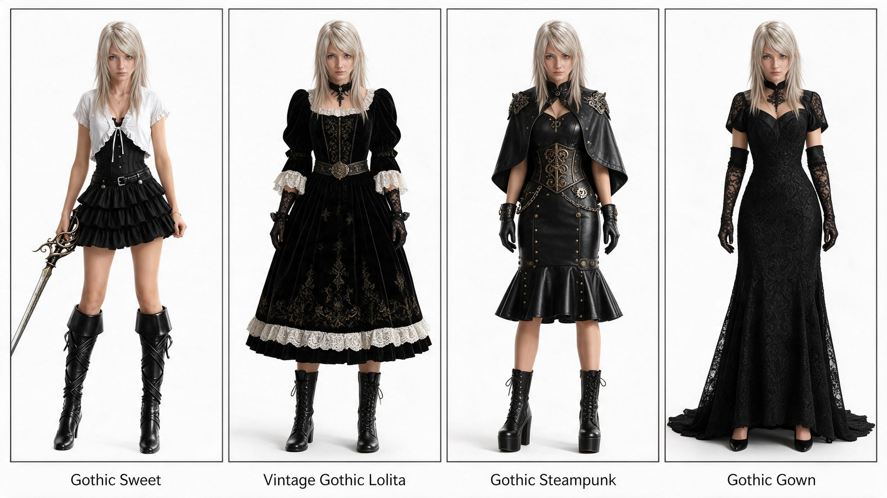
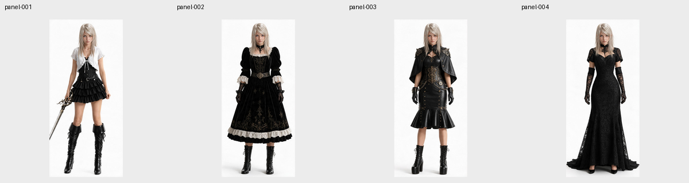
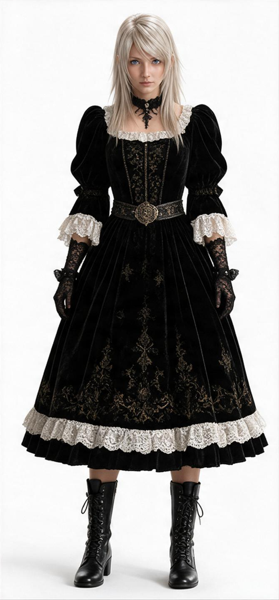
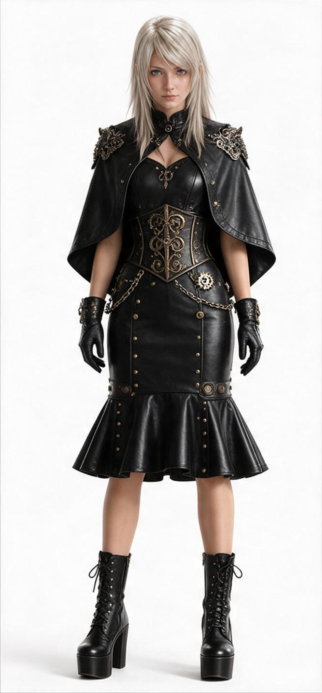
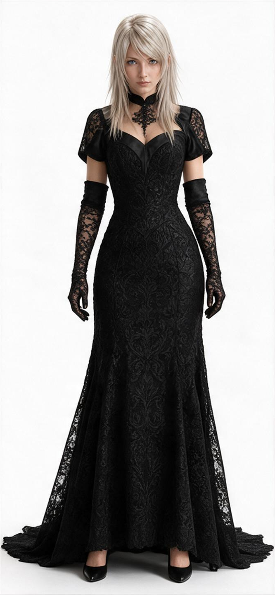

# UltraSplitter

UltraSplitter turns panels, turnarounds, contact sheets, and simple-background object collages into individually accessible image assets. It combines multimodal judgment with deterministic pixel operations instead of assuming that every source is an evenly spaced grid.

> Status: v0.1.0 provides a working deterministic splitter and a provider-neutral contract for generated repair. It does not call an image-generation API by itself.

## Why

Uniform slicing fails when panels have uneven widths, captions sit outside frames, subjects are scattered, or rectangular detection boxes overlap. UltraSplitter separates three decisions:

1. **Source crop** — preserve the original pixels when the subject is already complete.
2. **Source composite** — isolate separable foreground pixels and place them on a clean canvas when boxes overlap but silhouettes do not.
3. **Generated reconstruction** — prepare an auditable repair packet when pixels are missing or subjects cannot be separated. An agent must obtain user approval before generation.

## Real-world example

This real four-character reference was processed by UltraSplitter. The run completed with `success`: four panels were detected and all four outputs used `source_crop`, preserving the source pixels without generated reconstruction.

| Real test input | Actual split output contact sheet |
| --- | --- |
|  |  |

| Output 01 | Output 02 | Output 03 | Output 04 |
| --- | --- | --- | --- |
| [](docs/assets/real-gothic-output-01.png) | [](docs/assets/real-gothic-output-02.png) | [](docs/assets/real-gothic-output-03.png) | [](docs/assets/real-gothic-output-04.png) |

Click an individual output to open its full-resolution image.

## Install and run

```bash
git clone https://github.com/PlevanTem/UltraSplitter.git
cd UltraSplitter
python -m pip install -e .
ultrasplit run input.png --name character-views
```

Explicit agent planning remains available:

```bash
ultrasplit scan input.png --output-dir work/scan
ultrasplit apply input.png --scan work/scan/scan.json --plan work/plan.json --output-dir output/task
ultrasplit inspect output/task/manifest.json
```

For a repair-required result:

```bash
ultrasplit repair prepare output/task/manifest.json
# The host agent shows the request to the user and waits for approval.
ultrasplit repair approve output/task/manifest.json --group conflict-001
# The host generates one grid from the repair packet, then returns it:
ultrasplit repair ingest output/task/manifest.json --group conflict-001 --grid generated-grid.png
ultrasplit evaluate output/task/manifest.json --visual-verdict pass
```

## Architecture

```text
image → deterministic scan → multimodal plan → route
                                          ├─ source crop
                                          ├─ source composite
                                          └─ repair packet → user approval
                                                             ↓
                                               external image generation
                                                             ↓
                                          ingest → split → evaluate → exit
```

Every run writes a schema-v3 manifest with exact source coordinates, route evidence, provenance, approval state, bounded repair attempts, evaluation status, and absolute delivery paths. See [ARCHITECTURE.md](ARCHITECTURE.md).

## AI-native use

The repository includes a Codex-compatible skill under `skills/splitting-image-grids-by-content`. The same CLI contract can be called from Claude Code or other multimodal coding agents. Model providers remain outside the core package.

## Current boundary

- Supports framed panels and spatially separated objects on transparent or approximately uniform backgrounds.
- Does not perform complex semantic instance segmentation.
- Generated completion is reconstructed content, not recovered source truth.
- Dense, transparent, touching, or clipped cases return an explicit review or approval state instead of silent success.

## Roadmap

- Calibrate foreground-conflict thresholds on a larger licensed benchmark.
- Add provider adapters without coupling credentials to the core package.
- Add independent multimodal identity scoring and richer transparent-edge handling.
- Publish benchmark reports only after reproducible evaluation exists.

## License

MIT
