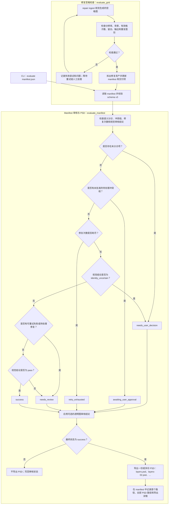

# Evaluator 评估流程

本图包含两条路径：对生成式修复宫格进行确定性检查，以及审核 manifest 并在主资产审核通过后导出分层 PSD。

```mermaid
flowchart TD
    subgraph A["修复宫格检查：evaluate_grid"]
        A1["repair ingest 收到生成的宫格图"] --> A2["检查分辨率、背景、有效格子数、留白、触边和重复图形"]
        A2 --> A3{"检查通过？"}
        A3 -- "否" --> A4["记录失败尝试和问题；等待重试或人工处理"]
        A3 -- "是" --> A5["拆出修复资产并更新 manifest 和交付项"]
        A5 --> B1
    end

    subgraph B["Manifest 审核与 PSD：evaluate_manifest"]
        B1["读取 manifest 并校验 schema v3"] --> B2["检查语义分诊、冲突组、修复次数和视觉审核结论"]
        B2 --> B3{"是否存在未分诊项？"}
        B3 -- "是" --> B4["needs_user_decision"]
        B3 -- "否" --> B31{"是否有未批准的待处理冲突组？"}
        B31 -- "是" --> B5["awaiting_user_approval"]
        B31 -- "否" --> B32{"修复次数是否耗尽？"}
        B32 -- "是" --> B6["retry_exhausted"]
        B32 -- "否" --> B33{"视觉结论是否为 identity_uncertain？"}
        B33 -- "是" --> B4
        B33 -- "否" --> B34{"是否有可重试失败或待处理修复？"}
        B34 -- "是" --> B7["needs_review"]
        B34 -- "否" --> B35{"视觉结论是否为 pass？"}
        B35 -- "是" --> B8["success"]
        B35 -- "否" --> B7
        B4 --> B9["应用可选的透明图审核结论"]
        B5 --> B9
        B6 --> B9
        B7 --> B9
        B8 --> B9
        B9 --> B10{"最终状态为 success？"}
        B10 -- "否" --> B11["不导出 PSD；写回审核状态"]
        B10 -- "是" --> B12["导出一份或多份 PSD：layers.psd、layers-02.psd、…"]
        B12 --> B13["在 manifest 中记录首个路径、全部 PSD 路径和导出详情"]
    end

    C["CLI：evaluate manifest.json"] --> B1
    A4 --> A1
```

`ultrasplit run` 负责生成并路由 manifest，本身不会通过审核门控。CLI 的 `evaluate` 命令，或修复宫格检查通过后的导入流程，会调用 `evaluate_manifest` 并可能进入 PSD 导出。
